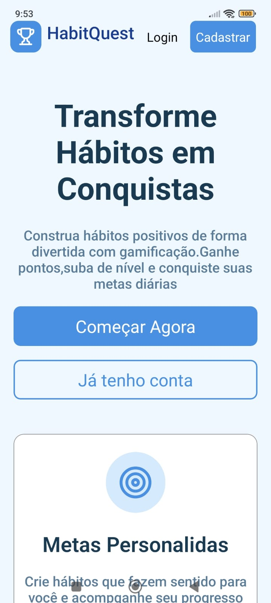
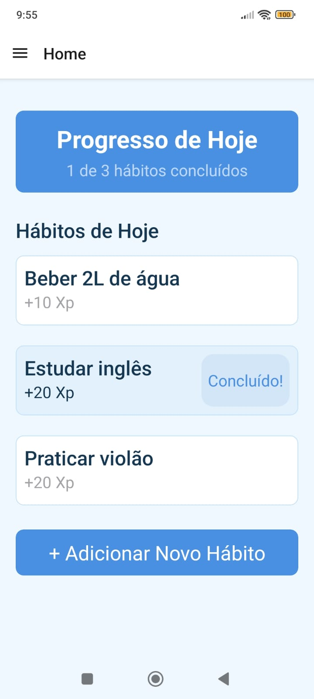
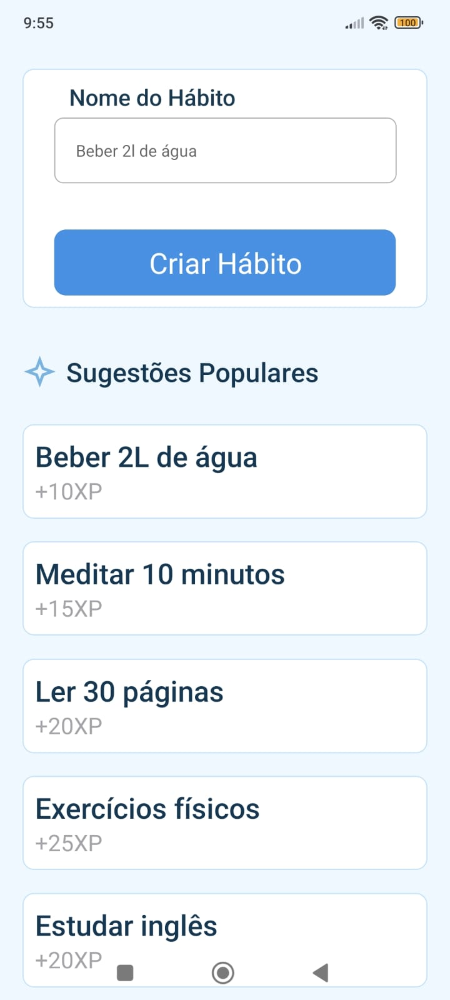
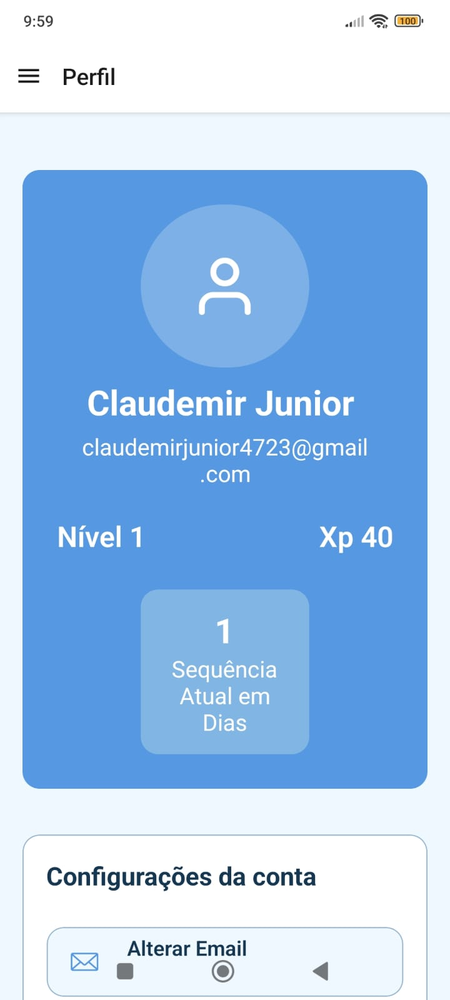

# 🎮 Habit Quest

Habit Quest é um aplicativo de **gamificação de hábitos**, criado com o objetivo de incentivar pessoas a manterem bons hábitos no dia a dia.

A proposta do app é simples e envolvente:
quanto mais consistente você for, mais recompensas você ganha 

---

## Sobre o projeto

O Habit Quest transforma a criação de hábitos em um jogo, onde o usuário:

* Mantém sequências de dias (streaks)
* Ganha XP ao completar hábitos
* Sobe de nível
* Desbloqueia conquistas

---

## Tecnologias utilizadas

### Frontend

* React Native (com Expo)

### Backend(API REST)

* Node.js
* Express

### Banco de Dados

* MySQL

### Segurança

* JWT (JSON Web Token) para autenticação
* Bcrypt para criptografia de senhas

---
## API (Backend)

A API do Habit Quest é responsável por toda a lógica do sistema, incluindo autenticação, gerenciamento de hábitos e progressão do usuário.

### Autenticação
Login com geração de token JWT
Rotas protegidas via middleware
Senhas armazenadas com hash seguro (Bcrypt)

### Principais endpoints
### Usuário
`POST /create` → Cadastro de usuário

`POST /login` → Autenticação e geração de token
### Hábitos
`GET /read/habit` → Listar hábitos do usuário

`POST /create/habit` → Criar novo hábito 

### Progresso
`POST /completed/habit` → Hábito concluído

`GET /user` → Obter progresso do usuário

---

##  Funcionalidades

* Cadastro e login de usuários
* Autenticação com JWT
* Senhas criptografadas com Bcrypt
* Sistema de XP e níveis
* Sistema de streak (dias consecutivos)
* Sistema de conquistas

---

## Telas do projeto

  
  
  
  

---

## Objetivo

Este projeto foi desenvolvido para:

* Consolidar conhecimentos em desenvolvimento fullstack
* Aplicar autenticação segura com JWT
* Desenvolver aplicações mobile com React Native
* Criar e consumir uma API REST

---

## Melhorias futuras

* Notificações para lembrar hábitos
* Dashboard com estatísticas
* Modo escuro
* Sistema social (ranking ou amigos)

---

## Observação

Este projeto está em constante evolução conforme novos conhecimentos são adquiridos 

## Autor
Claudemir Junior

Estudante de Análise e Desenvolvimento de Sistemas